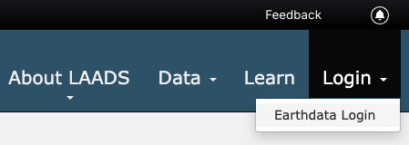
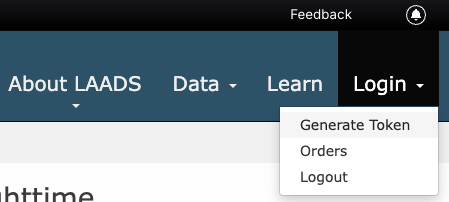
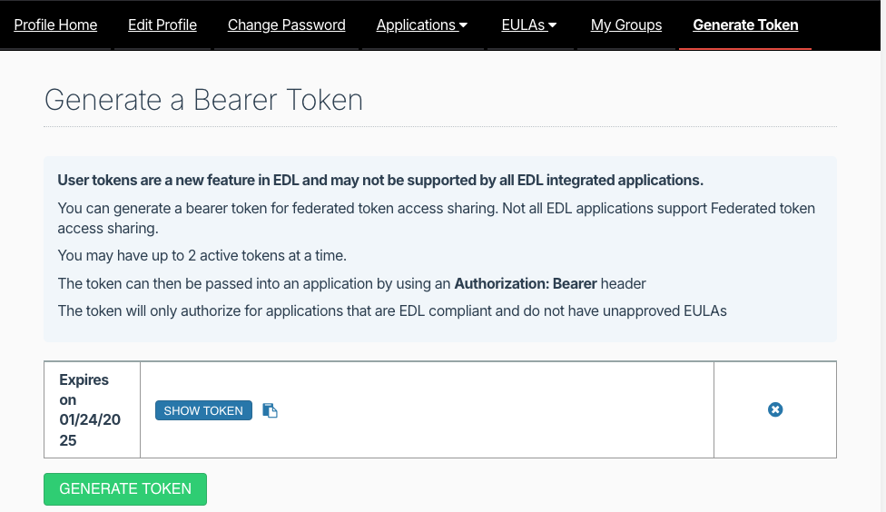
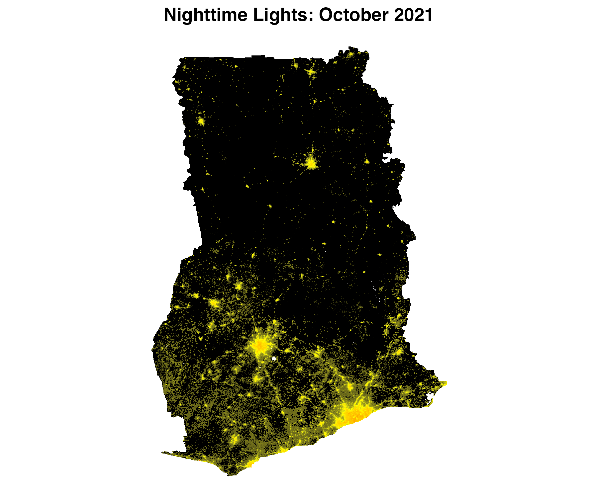
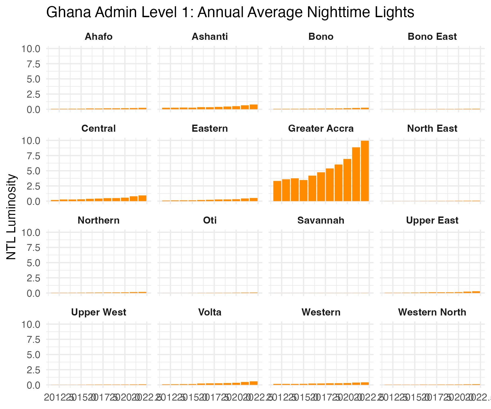

# BlackMarbleR 

<!-- badges: start -->

[](https://cran.r-project.org/package=blackmarbler)

[](https://github.com/worldbank/blackmarbler)
[](https://github.com/worldbank/blackmarbler/graphs/commit-activity)
[](https://opensource.org/license/mit)

<!-- badges: end -->

**BlackMarbleR** is a R package that provides a simple way to use nighttime lights data from NASA's Black Marble. [Black Marble](https://blackmarble.gsfc.nasa.gov) is a [NASA Earth Science Data Systems (ESDS)](https://www.earthdata.nasa.gov) project that provides a product suite of daily, monthly and yearly global [nighttime lights](https://www.earthdata.nasa.gov/learn/backgrounders/nighttime-lights). This package automates the process of downloading all relevant tiles from the [NASA LAADS DAAC](https://www.earthdata.nasa.gov/eosdis/daacs/laads) to cover a region of interest, converting and mosaicing the raw files (in HDF5 format) to georeferenced rasters.

* [Installation](#installation)
* [Bearer token](#token)
* [Usage](#usage)
  * [Setup](#setup)
  * [Make raster](#raster)
  * [Make raster across multiple time periods](#stack)
  * [Make map](#map)
  * [Make figure of trends in nighttime lights](#trends)
  * [Workflow to update data](#update-data)
* [Functions and arguments](#function-args)
  * [Functions](#functions)
  * [Required Arguments](#args-required)
  * [Optional Arguments](#args-optional)
  * [Argument only for `bm_extract`](#args-extract)
* [Black Marble Resources](#resources)

## Installation <a name="installation"></a>

The package can be installed via CRAN.

```r  
install.packages("blackmarbler")
```

To install the development version from Github:

```r
# install.packages("devtools")
devtools::install_github("worldbank/blackmarbler")
```

## Bearer Token <a name="token">

### Manually retrieve token <a name="token-manual">

The function requires using a **Earthdata Download Bearer Token**; to obtain a token, follow the below steps:

1. Go to the [NASA LAADS Archive](https://ladsweb.modaps.eosdis.nasa.gov/missions-and-measurements/products/VNP46A4/)
2. Click "Login" (button on top right), and click "Earthdata Login"; create an account if needed.
3. Enter your username and password.
4. Click "Login", then "Generate Token" on the dropdown.
5. Click the "Generate Token" tab, then click the green button to generate a token
6. Click the blue "Show token" button; this is your bearer token. It will be a long string of text (over 500 characters).

<p align="center">

</p>

<p align="center">

</p>

<p align="center">

</p>

### Manually retrieve token <a name="token-automatic">

The NASA Bearer Token can also be automatically retrieved using the `get_nasa_token`. After making an account, the `get_nasa_token` uses your username and password to retrieve the Bearer token.

```r
bearer <- get_nasa_token(username = "USERNAME-HERE", 
                         password = "PASSWORD-HERE")
```

## Usage <a name="usage">

### Setup <a name="setup">

Before downloading and extracting Black Marble data, we first load packages, define the NASA bearer token, and define a region of interest.

```r
#### Setup
# Load packages
library(blackmarbler)
library(geodata)
library(sf)
library(terra)
library(ggplot2)
library(tidyterra)
library(lubridate)

#### Define NASA bearer token
bearer <- "BEARER-TOKEN-HERE"

### ROI
# Define region of interest (roi). The roi must be (1) an sf polygon and (2)
# in the WGS84 (epsg:4326) coordinate reference system. Here, we use the
# getData function to load a polygon of Ghana
roi_sf <- gadm(country = "GHA", level=1, path = tempdir()) 
```

### Make raster of nighttime lights <a name="raster">

The below example shows making daily, monthly, and annual rasters of nighttime
lights for Ghana.

```r
### Daily data: raster for February 5, 2021
r_20210205 <- bm_raster(roi_sf = roi_sf,
                        product_id = "VNP46A2",
                        date = "2021-02-05",
                        bearer = bearer)

### Monthly data: raster for October 2021
r_202110 <- bm_raster(roi_sf = roi_sf,
                      product_id = "VNP46A3",
                      date = "2021-10-01", # The day is ignored
                      bearer = bearer)

### Annual data: raster for 2021
r_2021 <- bm_raster(roi_sf = roi_sf,
                    product_id = "VNP46A4",
                    date = 2021,
                    bearer = bearer)
```

### Make raster of nighttime lights across multiple time periods <a name="stack">

To extract data for multiple time periods, add multiple time periods to `date`. The function will return a `SpatRaster` object with multiple bands, where each band corresponds to a different date. The below code provides examples getting data across multiple days, months, and years.

```r
#### Daily data in March 2021
r_daily <- bm_raster(roi_sf = roi_sf,
                     product_id = "VNP46A2",
                     date = seq.Date(from = ymd("2021-03-01"), to = ymd("2021-03-31"), by = "day"),
                     bearer = bearer)

#### Monthly aggregated data in 2021 and 2022
r_monthly <- bm_raster(roi_sf = roi_sf,
                       product_id = "VNP46A3",
                       date = seq.Date(from = ymd("2021-01-01"), to = ymd("2022-12-01"), by = "month"),
                       bearer = bearer)

#### Yearly aggregated data in 2012 and 2021
r_annual <- bm_raster(roi_sf = roi_sf,
                      product_id = "VNP46A4",
                      date = 2012:2021,
                      bearer = bearer)
```

### Map of nighttime lights <a name="map">

Using one of the rasters, we can make a map of nighttime lights

```r
#### Make raster
r <- bm_raster(roi_sf = roi_sf,
               product_id = "VNP46A3",
               date = "2021-10-01",
               bearer = bearer)

#### Prep data
r <- r |> terra::mask(roi_sf)

## Distribution is skewed, so log
r[] <- log(r[] + 1)

##### Map
ggplot() +
  geom_spatraster(data = r) +
  scale_fill_gradient2(low = "black",
                       mid = "yellow",
                       high = "red",
                       midpoint = 4.5,
                       na.value = "transparent") +
  labs(title = "Nighttime Lights: October 2021") +
  coord_sf() +
  theme_void() +
  theme(plot.title = element_text(face = "bold", hjust = 0.5),
  legend.position = "none")
```

<p align="center">

</p>

### Trends over time <a name="trends">

We can use the `bm_extract` function to observe changes in nighttime lights over time. The `bm_extract` function leverages the [`exactextractr`](https://github.com/isciences/exactextractr) package to aggregate nighttime lights data to polygons. Below we show trends in annual nighttime lights data across Ghana's first administrative divisions.

```r
#### Extract annual data
ntl_df <- bm_extract(roi_sf = roi_sf,
                     product_id = "VNP46A4",
                     date = 2012:2022,
                     bearer = bearer)

#### Trends over time
ntl_df |>
  ggplot() +
  geom_col(aes(x = date,
  y = ntl_mean),
  fill = "darkorange") +
  facet_wrap(~NAME_1) +
  labs(x = NULL,
       y = "NTL Luminosity",
       title = "Ghana Admin Level 1: Annual Average Nighttime Lights") +
  scale_x_continuous(labels = seq(2012, 2022, 4),
                     breaks = seq(2012, 2022, 4)) +
  theme_minimal() +
  theme(strip.text = element_text(face = "bold"))
```

<p align="center">

</p>

### Workflow to update data <a name="update-data">

Some users may want to monitor near-real-time changes in nighttime lights. For example, daily Black Marble nighttime lights data is updated regularly, where data is available roughly on a week delay; same use cases may require examining trends in daily nighttime lights data as new data becomes available. Below shows example code that could be regularly run to produce an updated daily dataset of nighttime lights.

The below code produces a dataframe of nighttime lights for each date, where average nighttime lights for Ghana's 1st administrative division is produced. The code will check whether data has already been downloaded/extracted for a specific date, and only download/extract new data.

```r
# Create directories to store data
dir.create(file.path(getwd(), "bm_files"))
dir.create(file.path(getwd(), "bm_files", "daily"))

# Extract daily-level nighttime lights data for Ghana's first administrative divisions.
# Save a separate dataset for each date in the `"~/Desktop/bm_files/daily"` directory.
# The code extracts data from January 1, 2023 to today. Given that daily nighttime lights
# data is produced on roughly a week delay, the function will only extract data that exists;
# it will skip extracting data for dates where data has not yet been produced by NASA Black Marble.
bm_extract(roi_sf = roi_sf,
           product_id = "VNP46A2",
           date = seq.Date(from = ymd("2023-01-01"), to = Sys.Date(), by = 1),
           bearer = bearer,
           output_location_type = "file",
           file_dir = file.path(getwd(), "bm_files", "daily"))

# Append daily-level datasets into one file
file.path(getwd(), "bm_files", "daily") |>
  list.files(pattern = "*.Rds",
  full.names = T) |>
  map_df(readRDS) |>
  saveRDS(file.path(getwd(), "bm_files", "ntl_daily.Rds"))
```

## Functions and arguments <a name="function-args">

### Functions <a name="functions">

The package provides two functions.

* `bm_raster` produces a raster of Black Marble nighttime lights.
* `bm_extract` produces a dataframe of aggregated nighttime lights to a region of interest (e.g., average nighttime lights within US States).

Both functions take the following arguments:

### Required arguments <a name="args-required">

* **roi_sf:** Region of interest; sf polygon. Must be in the [WGS 84 (epsg:4326)](https://epsg.io/4326) coordinate reference system. For `bm_extract`, aggregates nighttime lights within each polygon of `roi_sf`.

* **product_id:** One of the following:

  * `"VNP46A1"`: Daily (raw)
  * `"VNP46A2"`: Daily (corrected)
  * `"VNP46A3"`: Monthly
  * `"VNP46A4"`: Annual

* **date:**  Date of raster data. Entering one date will produce a `SpatRaster` object. Entering multiple dates will produce a `SpatRaster` object with multiple bands; one band per date.

  * For `product_id`s `"VNP46A1"` and `"VNP46A2"`, a date (eg, `"2021-10-03"`).
  * For `product_id` `"VNP46A3"`, a date or year-month (e.g., `"2021-10-01"`, where the day will be ignored, or `"2021-10"`).
  * For `product_id` `"VNP46A4"`, year or date  (e.g., `"2021-10-01"`, where the month and day will be ignored, or `2021`).

* **bearer:** NASA bearer token. For instructions on how to create a token, see [here](https://github.com/worldbank/blackmarbler#bearer-token-).

### Optional arguments <a name="args-optional">

* **variable:** Variable to used to create raster (default: `NULL`). For information on all variable choices, see [here](https://ladsweb.modaps.eosdis.nasa.gov/api/v2/content/archives/Document%20Archive/Science%20Data%20Product%20Documentation/VIIRS_Black_Marble_UG_v1.2_April_2021.pdf); for `VNP46A1`, see Table 3; for `VNP46A2` see Table 6; for `VNP46A3` and `VNP46A4`, see Table 9. If `NULL`, uses the following default variables:

  * For `product_id` `"VNP46A1"`, uses `DNB_At_Sensor_Radiance_500m`.
  * For `product_id` `"VNP46A2"`, uses `Gap_Filled_DNB_BRDF-Corrected_NTL`.
  * For `product_id`s `"VNP46A3"` and `"VNP46A4"`, uses `NearNadir_Composite_Snow_Free`.

* **quality_flag_rm:** Quality flag values to use to set values to `NA`. Each pixel has a quality flag value, where low quality values can be removed. Values are set to `NA` for each value in ther `quality_flag_rm` vector. (Default: `NULL`).

  * For `VNP46A1` and `VNP46A2` (daily data):
    * `0`: High-quality, Persistent nighttime lights
    * `1`: High-quality, Ephemeral nighttime Lights
    * `2`: Poor-quality, Outlier, potential cloud contamination, or other issues

  * For `VNP46A3` and `VNP46A4` (monthly and annual data):
    * `0`: Good-quality, The number of observations used for the composite is larger than 3
    * `1`: Poor-quality, The number of observations used for the composite is less than or equal to 3
    * `2`: Gap filled NTL based on historical data

* **check_all_tiles_exist:** Check whether all Black Marble nighttime light tiles exist for the region of interest. Sometimes not all tiles are available, so the full region of interest may not be covered. If `TRUE`, skips cases where not all tiles are available. (Default: `TRUE`).
* **interpol_na:** When data for more than one date is downloaded, whether to interpolate `NA` values in rasters using the [`terra::approximate`](https://www.rdocumentation.org/packages/raster/versions/3.6-26/topics/approxNA) function. Additional arguments for the [`terra::approximate`](https://www.rdocumentation.org/packages/raster/versions/3.6-26/topics/approxNA) function can also be passed into `bm_raster`/`bm_extract` (eg, `method`, `rule`, `f`, `ties`, `z`, `NA_rule`). (Default: `FALSE`).
* **h5_dir:** Black Marble data are originally downloaded as `h5` files. If `h5_dir = NULL`, the function downloads to a temporary directory then deletes the directory. If `h5_dir` is set to a path, `h5` files are saved to that directory and not deleted. The function will then check if the needed `h5` file already exists in the directory; if it exists, the function will not re-download the `h5` file.


* **output_location_type:** Where output should be stored (default: `r_memory`). Either:

  * `r_memory` where the function will return an output in R
  * `file` where the function will export the data as a file. For `bm_raster`, a `.tif` file will be saved; for `bm_extract`, a `.Rds` file will be saved. A file is saved for each date. Consequently, if `date = c(2018, 2019, 2020)`, three datasets will be saved: one for each year. Saving a dataset for each date can facilitate re-running the function later and only downloading data for dates where data have not been downloaded.

If `output_location_type = "file"`, the following arguments can be used:

* **file_dir:** The directory where data should be exported (default: `NULL`, so the working directory will be used)
* **file_prefix:** Prefix to add to the file to be saved. The file will be saved as the following: `[file_prefix][product_id]_t[date].[tif/Rds]`
* **file_skip_if_exists:** Whether the function should first check wither the file already exists, and to skip downloading or extracting data if the data for that date if the file already exists (default: `TRUE`). If the function is first run with `date = c(2018, 2019, 2020)`, then is later run with `date = c(2018, 2019, 2020, 2021)`, the function will only download/extract data for 2021. Skipping existing files can facilitate re-running the function at a later date to download only more recent data.
* **file_return_null:** Whether to return `NULL` instead of a output to R (`SpatRaster` or `dataframe`). When `output_location_type = 'file'`, the function will export data to the `file_dir` directory. When `file_return_null = FALSE`, the function will also return the queried data---so the data is available in R memory. Setting `file_return_null = TRUE`, data will be saved to `file_dir` but no data will be returned by the function to R memory (default: `FALSE`).

  
* **...:** Additional arguments for [`terra::approximate`](https://rspatial.github.io/terra/reference/approximate.html), if `interpol_na = TRUE`

### Argument for `bm_extract` only <a name="args-extract">

* **aggregation_fun:** A vector of functions to aggregate data (default: `"mean"`). The `exact_extract` function from the `exactextractr` package is used for aggregations; this parameter is passed to `fun` argument in `exactextractr::exact_extract`.
* **add_n_pixels:** Whether to add a variable indicating the number of nighttime light pixels used to compute nighttime lights statistics (eg, number of pixels used to compute average of nighttime lights). When `TRUE`, it adds three values: `n_non_na_pixels` (the number of non-`NA` pixels used for computing nighttime light statistics); `n_pixels` (the total number of pixels); and `prop_non_na_pixels` the proportion of the two. (Default: `TRUE`).

## Black Marble Resources <a name="resources">

For more information on NASA Black Marble, see:

* [Academic paper](https://www.sciencedirect.com/science/article/pii/S003442571830110X)
* [Substack Post](https://yohaniddawela.substack.com/p/not-all-nightlight-datasets-are-the)
* [Webinar](https://appliedsciences.nasa.gov/get-involved/training/english/arset-introduction-nasas-black-marble-night-lights-data)
