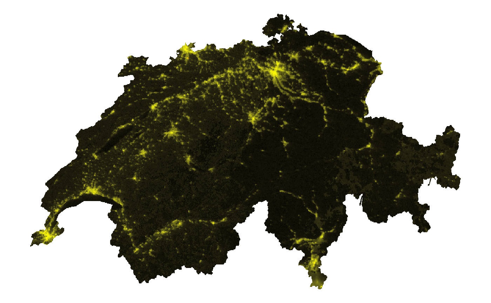
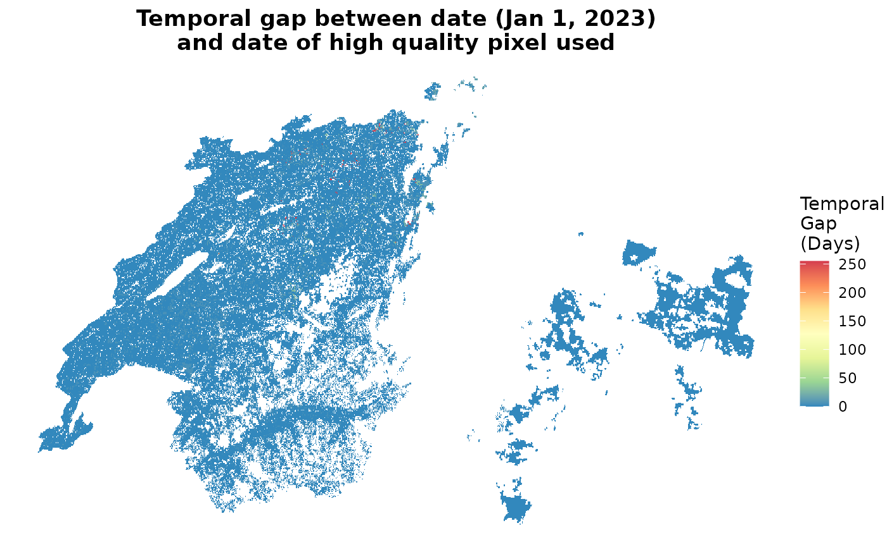
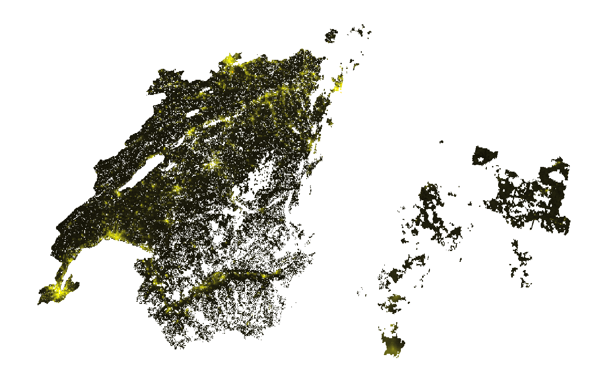
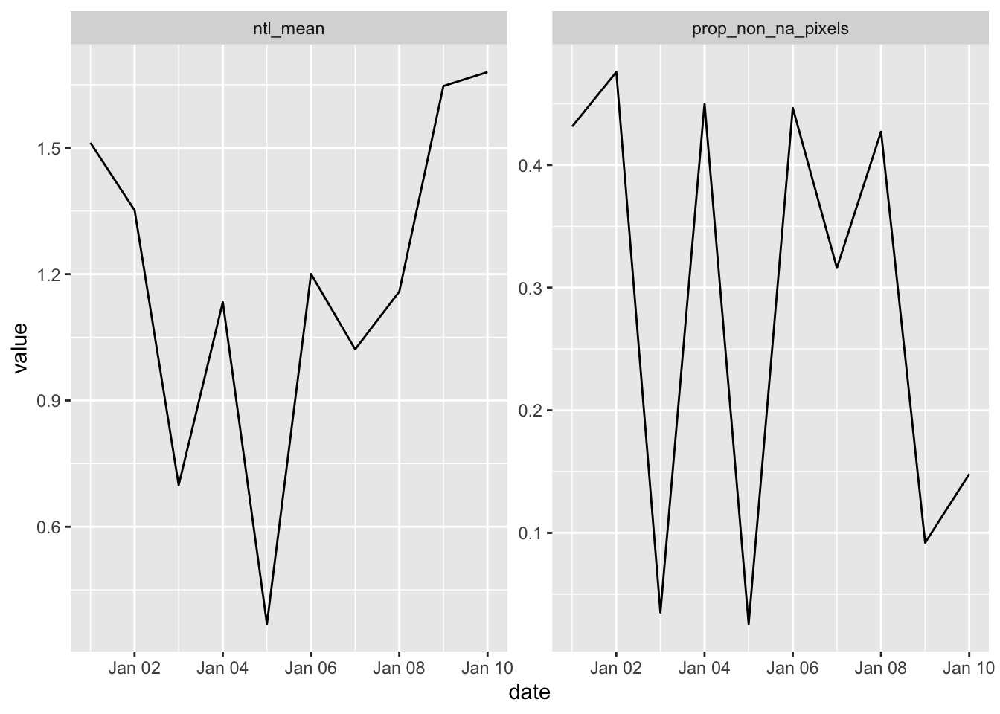
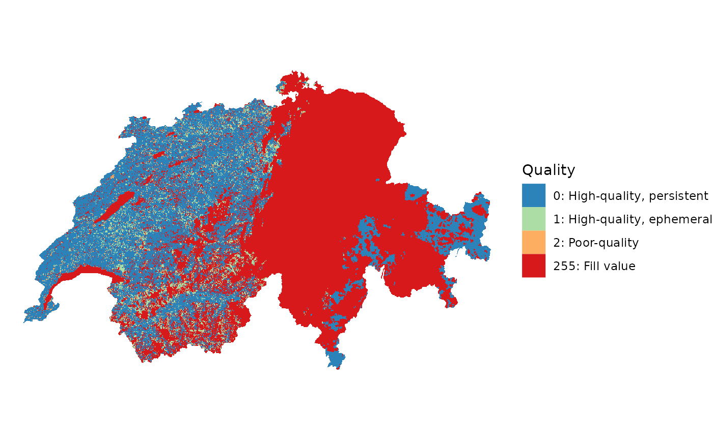
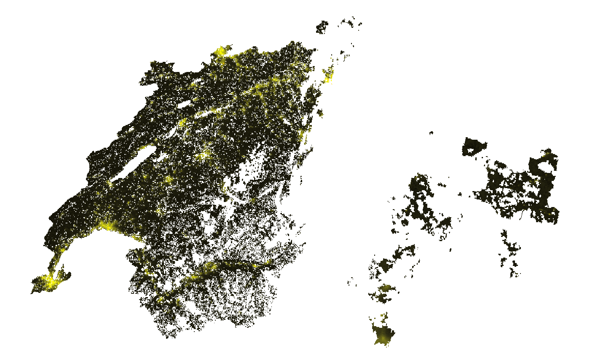
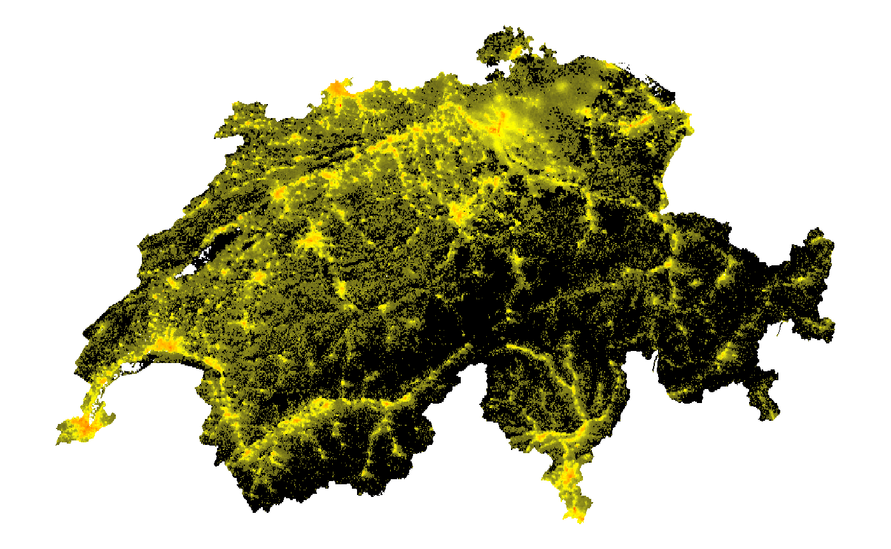
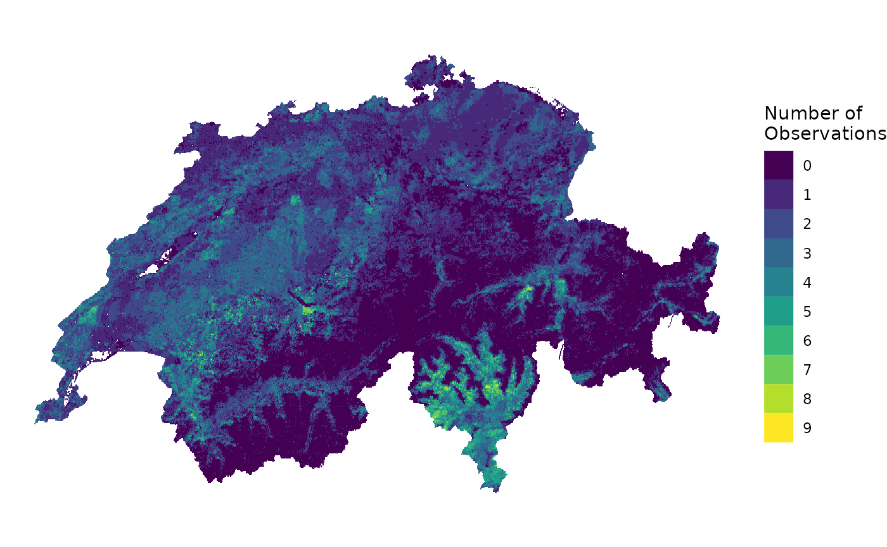
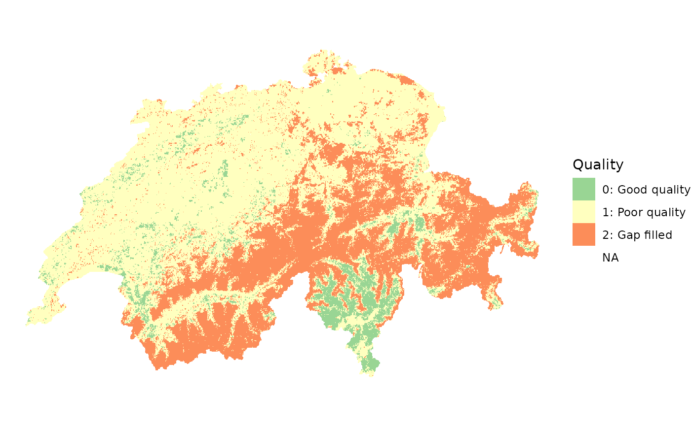
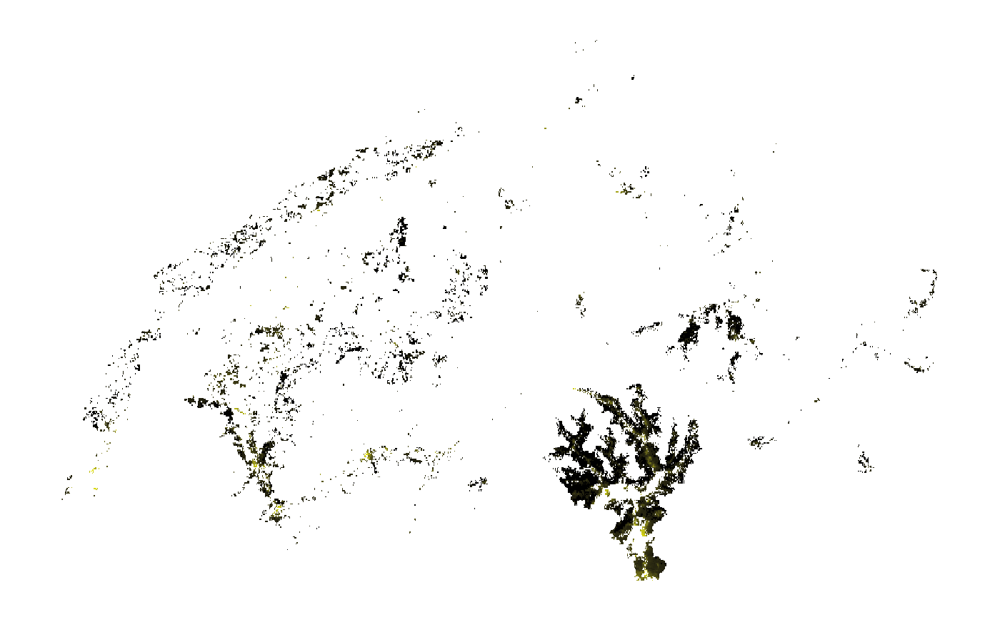

# Assessing Quality of Nighttime Lights Data

### Overview 

The quality of nighttime lights data can be impacted by a number of
factors, particularly cloud cover. To facilitate analysis using high
quality data, Black Marble (1) marks the quality of each pixel and (2)
in some cases, uses data from a previous date to fill the value—using a
temporally-gap filled NTL value.

This page illustrates how to examine the quality of nighttime lights
data.

- [Setup](#setup)
- [Daily data](#daily)
  - [Nighttime lights: Gap Filled](#daily-ntl-gap)
  - [Nighttime lights: Non Gap Filled](#daily-ntl-nongap)
  - [Quality flag](#daily-quality)
  - [Nighttime lights using good quality observations](#daily-goodq)
- [Monthly/annual data](#ma)
  - [Nighttime lights](#ma-ntl)
  - [Number of observations](#ma-numobs)
  - [Quality](#ma-quality)
  - [Nighttime lights using good quality observations](#ma-ntl_gq)

### Setup 

We first load packages and obtain a polygon for a region of interest;
for this example, we use Switzerland.

``` r

library(blackmarbler)
library(geodata)
library(sf)
library(raster)
library(ggplot2)
library(tidyterra)
library(dplyr)
library(exactextractr)
library(lubridate)
library(tidyr)
library(geodata)
library(knitr)

bearer <- "BEARER-TOKEN-HERE"
```

``` r

roi_sf <- gadm(country = "CHE", level=0, path = tempdir()) |> st_as_sf()
```

### Daily Data 

Below shows an example examining quality for daily data (`VNP46A2`).

#### Gap filled nighttime lights 

We download data for January 1st, 2023. When the `variable` parameter is
not specified, `bm_raster` creates a raster using the
`Gap_Filled_DNB_BRDF-Corrected_NTL` variable for daily data. This
variable “gap fills” poor quality observations (ie, pixels with cloud
cover) using data from previous days.

``` r

ntl_r <- bm_raster(roi_sf = roi_sf,
                   product_id = "VNP46A2",
                   date = "2023-01-01",
                   bearer = bearer,
                   variable = "Gap_Filled_DNB_BRDF-Corrected_NTL")
```

Show code to produce map

``` r

#### Prep data
ntl_m_r <- ntl_r |> terra::mask(roi_sf) 

## Distribution is skewed, so log
ntl_m_r[] <- log(ntl_m_r[]+1)

##### Map 
ggplot() +
  geom_spatraster(data = ntl_m_r) +
  scale_fill_gradient2(low = "black",
                       mid = "yellow",
                       high = "red",
                       midpoint = 4,
                       na.value = "transparent") +
  coord_sf() + 
  theme_void() +
  theme(plot.title = element_text(face = "bold", hjust = 0.5),
        legend.position = "none")
```



The `Latest_High_Quality_Retrieval` indicates the number of days since
the current date that the nighttime lights value comes from for gap
filling.

``` r

ntl_tmp_gap_r <- bm_raster(roi_sf = roi_sf,
                           product_id = "VNP46A2",
                           date = "2023-01-01",
                           bearer = bearer,
                           variable = "Latest_High_Quality_Retrieval")
```

Show code to produce map

``` r

#### Prep data
ntl_tmp_gap_r <- ntl_tmp_gap_r |> terra::mask(roi_sf) 

##### Map 
ggplot() +
  geom_spatraster(data = ntl_tmp_gap_r) +
  scale_fill_distiller(palette = "Spectral",
                       na.value = "transparent") +
  coord_sf() + 
  theme_void() +
  labs(fill = "Temporal\nGap\n(Days)",
       title = "Temporal gap between date (Jan 1, 2023)\nand date of high quality pixel used") +
  theme(plot.title = element_text(face = "bold", hjust = 0.5))
```



#### Non gap filled nighttime lights 

Instead of using gap-filled data, we could also just use nighttime light
values from the date selected using the `DNB_BRDF-Corrected_NTL`
variable.

``` r

ntl_r <- bm_raster(roi_sf = roi_sf,
                   product_id = "VNP46A2",
                   date = "2023-01-01",
                   bearer = bearer,
                   variable = "DNB_BRDF-Corrected_NTL")
```

Show code to produce map

``` r

#### Prep data
ntl_m_r <- ntl_r |> terra::mask(roi_sf) 

## Distribution is skewed, so log
ntl_m_r[] <- log(ntl_m_r[] + 1)

##### Map 
ggplot() +
  geom_spatraster(data = ntl_m_r) +
  scale_fill_gradient2(low = "black",
                       mid = "yellow",
                       high = "red",
                       midpoint = 4,
                       na.value = "transparent") +
  coord_sf() + 
  theme_void() +
  theme(plot.title = element_text(face = "bold", hjust = 0.5),
        legend.position = "none")
```



We notice that a number of observations are missing. To understand the
extent of missing date, we can use the following code to determine (1)
the total number of pixels that cover Switzerland, (2) the total number
of non-`NA` nighttime light pixels, and (3) the proportion of non-`NA`
pixels.

``` r

n_pixel <- function(values, coverage_fraction){
  length(values)
}

n_non_na_pixel <- function(values, coverage_fraction){
  sum(!is.na(values))
}

n_pixel_num        <- exact_extract(ntl_r, roi_sf, n_pixel)
n_non_na_pixel_num <- exact_extract(ntl_r, roi_sf, n_non_na_pixel)

print(n_pixel_num)
#> [1] 282934
print(n_non_na_pixel_num)
#> [1] 152285
print(n_non_na_pixel_num / n_pixel_num)
#> [1] 0.5382351
```

By default, the `bm_extract` function computes these values:

``` r

ntl_df <- bm_extract(roi_sf = roi_sf,
                     product_id = "VNP46A2",
                   date = seq.Date(from = ymd("2023-01-01"),
                                   to = ymd("2023-01-10"),
                                   by = 1),
                   bearer = bearer,
                   variable = "DNB_BRDF-Corrected_NTL")

knitr::kable(ntl_df)
```

The below figure shows trends in average nighttime lights (left) and the
proportion of the country with a value for nighttime lights (right). For
some days, low number of pixels corresponds to low nighttime lights (eg,
January 3 and 5th); however, for other days, low number of pixels
corresponds to higher nighttime lights (eg, January 9 and 10). On
January 3 and 5, missing pixels could have been over typically high-lit
areas (eg, cities)—while on January 9 and 10, missing pixels could have
been over typically lower-lit areas.

Show code to produce figure

``` r


ntl_df %>%
  dplyr::select(date, ntl_sum, prop_non_na_pixels) %>%
  pivot_longer(cols = -date) %>%
  
  ggplot(aes(x = date,
             y = value)) + 
  geom_line() +
  facet_wrap(~name,
             scales = "free")
```



#### Quality 

For daily data, the quality values are:

- 0: High-quality, Persistent nighttime lights

- 1: High-quality, Ephemeral nighttime Lights

- 2: Poor-quality, Outlier, potential cloud contamination, or other
  issues

We can map quality by using the `Mandatory_Quality_Flag` variable.

``` r

quality_r <- bm_raster(roi_sf = roi_sf,
                       product_id = "VNP46A2",
                       date = "2023-01-01",
                       bearer = bearer,
                       variable = "Mandatory_Quality_Flag")
```

Show code to produce map

``` r

#### Prep data
quality_r <- quality_r |> terra::mask(roi_sf) 

qual_levels <- data.frame(id=0:2, cover=c("0: High-quality, persistent", 
                                  "1: High-quality, ephemeral", 
                                  "2: Poor-quality"))

levels(quality_r) <- qual_levels

##### Map 
ggplot() +
  geom_spatraster(data = quality_r) +
  scale_fill_brewer(palette = "Spectral", 
                    direction = -1,
                    na.value = "transparent") + 
  labs(fill = "Quality") +
  coord_sf() + 
  theme_void() +
  theme(plot.title = element_text(face = "bold", hjust = 0.5))
```



#### Nighttime lights for good quality observations 

The `quality_flag_rm` parameter determines which pixels are set to `NA`
based on the quality indicator. By default, no pixels are filtered out
(except for those that are assigned a “fill value” by BlackMarble, which
are always removed). However, if we only want data for good quality
pixels, we can adjust the `quality_flag_rm` parameter.

``` r

ntl_good_qual_r <- bm_raster(roi_sf = roi_sf,
                             product_id = "VNP46A2", 
                             date = "2023-01-01",
                             bearer = bearer,
                             variable = "DNB_BRDF-Corrected_NTL",
                             quality_flag_rm = 2)
```

Show code to produce map

``` r

#### Prep data
ntl_good_qual_r <- ntl_good_qual_r |> terra::mask(roi_sf) 

## Distribution is skewed, so log
ntl_good_qual_r[] <- log(ntl_good_qual_r[]+1)

##### Map 
ggplot() +
  geom_spatraster(data = ntl_good_qual_r) +
  scale_fill_gradient2(low = "black",
                       mid = "yellow",
                       high = "red",
                       midpoint = 4,
                       na.value = "transparent") +
  coord_sf() + 
  theme_void() +
  theme(plot.title = element_text(face = "bold", hjust = 0.5),
        legend.position = "none")
```



### Monthly/Annual Data 

Below shows an example examining quality for monthly data (`VNP46A3`).
The same approach can be used for annual data (`VNP46A4`); the variables
are the same for both monthly and annual data.

#### Nighttime Lights 

We download data for January 2023. When the `variable` parameter is not
specified, `bm_raster` creates a raster using the
`NearNadir_Composite_Snow_Free` variable for monthly and annual
data—which is nighttime lights, removing effects from snow cover.

``` r

ntl_r <- bm_raster(roi_sf = roi_sf,
                   product_id = "VNP46A3", 
                   date = "2023-01-01",
                   bearer = bearer,
                   variable = "NearNadir_Composite_Snow_Free")
```

Show code to produce map

``` r

#### Prep data
ntl_r <- ntl_r |> terra::mask(roi_sf) 

## Distribution is skewed, so log
ntl_r[] <- log(ntl_r[] + 1)

##### Map 
ggplot() +
  geom_spatraster(data = ntl_r) +
  scale_fill_gradient2(low = "black",
                       mid = "yellow",
                       high = "red",
                       midpoint = 4,
                       na.value = "transparent") +
  coord_sf() + 
  theme_void() +
  theme(plot.title = element_text(face = "bold", hjust = 0.5),
        legend.position = "none")
```



#### Number of Observations 

Black Marble removes poor quality observations, such as pixels covered
by clouds. To determine the number of observations used to generate
nighttime light values for each pixel, we add `_Num` to the variable
name.

``` r

cf_r <- bm_raster(roi_sf = roi_sf,
                  product_id = "VNP46A3",
                  date = "2023-01-01",
                  bearer = bearer,
                  variable = "NearNadir_Composite_Snow_Free_Num")
```

Show code to produce map

``` r

#### Prep data
cf_r <- cf_r |> terra::mask(roi_sf) 

##### Map 
ggplot() +
  geom_spatraster(data = cf_r) +
  scale_fill_viridis_c(na.value = "transparent") + 
  labs(fill = "Number of\nObservations") +
  coord_sf() + 
  theme_void() +
  theme(plot.title = element_text(face = "bold", hjust = 0.5))
```



#### Quality 

For monthly and annual data, the quality values are:

- 0: Good-quality, The number of observations used for the composite is
  larger than 3

- 1: Poor-quality, The number of observations used for the composite is
  less than or equal to 3

- 2: Gap filled NTL based on historical data

We can map quality by adding `_Quality` to the variable name.

``` r

quality_r <- bm_raster(roi_sf = roi_sf,
                       product_id = "VNP46A3",
                       date = "2023-01-01",
                       bearer = bearer,
                       variable = "NearNadir_Composite_Snow_Free_Quality")
```

Show code to produce map

``` r

#### Prep data
quality_r <- quality_r |> terra::mask(roi_sf) 

qual_levels <- data.frame(id=0:2, cover=c("0: Good quality", 
                                  "1: Poor quality", 
                                  "2: Gap filled"))

levels(quality_r) <- qual_levels

##### Map 
ggplot() +
  geom_spatraster(data = quality_r) +
  scale_fill_brewer(palette = "Spectral", 
                    direction = -1,
                    na.value = "transparent") + 
  labs(fill = "Quality") +
  coord_sf() + 
  theme_void() +
  theme(plot.title = element_text(face = "bold", hjust = 0.5))
```



#### Nighttime lights for good quality observations 

The `quality_flag_rm` parameter determines which pixels are set to `NA`
based on the quality indicator. By default, no pixels are filtered out
(except for those that are assigned a “fill value” by BlackMarble, which
are always removed). However, if we also want to remove poor quality
pixels and remove pixels that are gap filled, we can adjust the
`quality_flag_rm` parameter.

``` r

ntl_good_qual_r <- bm_raster(roi_sf = roi_sf,
                             product_id = "VNP46A3", 
                             date = "2023-01-01",
                             bearer = bearer,
                             variable = "NearNadir_Composite_Snow_Free",
                             quality_flag_rm = c(1,2)) # 1 = poor quality; 2 = gap filled based on historical data
```

Show code to produce map

``` r

#### Prep data
ntl_good_qual_r <- ntl_good_qual_r |> terra::mask(roi_sf) 

## Distribution is skewed, so log
ntl_good_qual_r[] <- log(ntl_good_qual_r[] + 1)

##### Map 
ggplot() +
  geom_spatraster(data = ntl_good_qual_r) +
  scale_fill_gradient2(low = "black",
                       mid = "yellow",
                       high = "red",
                       midpoint = 4,
                       na.value = "transparent") +
  coord_sf() + 
  theme_void() +
  theme(plot.title = element_text(face = "bold", hjust = 0.5),
        legend.position = "none")
```


